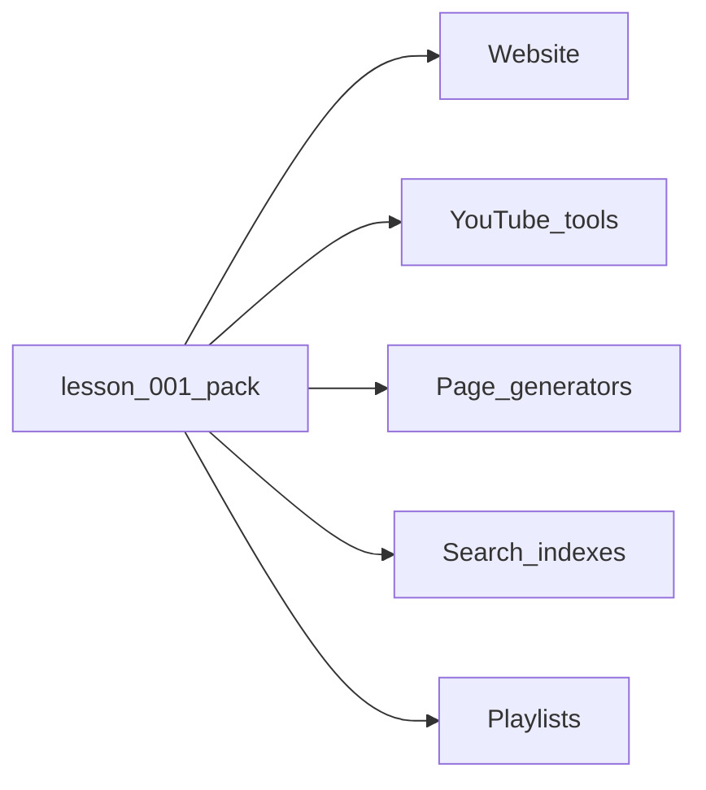

# KML Website V2 — Site Architecture

## Purpose

KML V2 is a **publishing platform**, not a pile of hand-edited HTML.

The live site under `kml/` stays untouched. This project (`kml_v2/`) is a parallel foundation for:

- website pages
- YouTube titles / descriptions / playlists
- gallery exhibitions
- ambient collections
- future books and apps
- automation (page generation, sitemaps, search indexes)

**One metadata layer. Many consumers.** The website is only the first consumer.

---

## Governing principles

**[Core Development Principles](core_principles.md) take precedence over implementation details.**

Summary:

1. Metadata first — HTML is generated, not authored as truth
2. Lesson 1 defines the pattern — approve before mass migration
3. Content before presentation — curriculum lives in data
4. HTML is disposable — regeneratable from metadata
5. Media outside Git — reference paths only
6. Stable media paths — no scattered storage assumptions
7. Validate metadata — schemas now; CI when mature
8. Grow indexes incrementally — thin indexes, rich lesson packs
9. Migrate knowledge, not HTML
10. One source of truth — no duplicated facts

Success = how little duplicated information exists across the project.

---

## Top-level layout

```
kml_v2/
├── docs/                 Principles, architecture, migration
├── data/                 Curriculum metadata (source of truth)
├── media/                Large binaries (gitignored)
├── assets/               CSS, JS, small committed UI assets
├── components/           Reusable HTML partials
├── templates/            Page shells (structure only)
├── books/                Generated / demo presentation
├── gallery/
├── ambient/
├── vocabulary/
├── beyond_joyo/
└── index.html
```

---

## Metadata architecture (lesson-centered)

> **Approved reference model:** Lesson 001.  
> Locked decisions: [architecture_decisions.md](architecture_decisions.md)

### Shape

```
data/
├── books/
│   ├── index.json
│   └── book_01.json
├── lessons/
│   ├── index.json              # lightweight summaries only
│   └── lesson_001/             # self-contained pack (reference)
│       ├── lesson.json
│       ├── kanji.json          # required
│       ├── vocabulary.json     # atoms
│       ├── phrases.json
│       ├── compounds.json
│       ├── gallery.json
│       ├── youtube.json
│       └── assets.json
├── playlists/
├── gallery/
├── ambient/
├── youtube/
├── site/
└── schema/
```

### Why packs

KML is centered on lessons. A pack keeps related curriculum surfaces together without bloating the global index. One fact lives in one file; consumers reference.

| File | Responsibility |
|---|---|
| `lesson.json` | Identity, title, summary, book link, status, relationships, nav, HTML `path` |
| `kanji.json` | First-class characters: keyword, verse, readings, primitives, study paths |
| `vocabulary.json` | Atomic vocabulary |
| `phrases.json` | Multi-word / phrasal units |
| `compounds.json` | Compounds (distinct from vocabulary) |
| `gallery.json` | Gallery / ambient collection relationships |
| `youtube.json` | Video id, description, chapters, playlist membership |
| `assets.json` | Lesson-level logical media roots under `media/lessons/lesson_NNN/` |

**IDs:** `lesson_001`, `lesson_002`, … (3-digit).  
**Presentation paths** (e.g. `books/book_01/lessons/lesson_01.html`) are output locations recorded in `lesson.json` → `path`, not a second source of truth for titles.

Validate packs with `scripts/validate_metadata.py` before bulk authoring.

### Indexes

`lessons/index.json` holds only summary fields (`id`, `number`, `book_id`, `title`, `keyword`, `status`, `youtube_id`, `path`, `pack`, `tags`). Full copy never belongs here.

### Media paths (stable)

```text
media/lessons/lesson_001/hero.jpg
media/lessons/lesson_001/thumb.jpg
media/lessons/lesson_001/study.png
media/lessons/lesson_001/audio.mp3
media/lessons/lesson_001/video.mp4
```

Declared in `assets.json`. Binaries are gitignored. Physical storage may later map these logical paths to disk/CDN without rewriting curriculum facts.

### Consumers



Access layer: `assets/js/data.js` (`KML.data.lesson`, `lessonPack`, indexes, …).

---

## Component architecture

Partials under `components/`, included via `data-include` + `includes.js`.
Pages set `data-site-root` so `{{root}}` resolves at any depth.

| Area | Role |
|---|---|
| header / footer / navigation | Shared chrome |
| bookshelf / lesson cards | Listing patterns |
| cards / gallery | Paper cards & tiles |
| layout | Page / content wrappers |

Serve over HTTP (`fetch` for includes and JSON):

```bash
cd kml_v2 && python3 -m http.server 8765
```

---

## CSS / JS / templates

**CSS** (`assets/css/main.css` imports):  
`variables` · `typography` · `layout` · `navigation` · `cards` · `books` · `lessons` · `utilities`

**JS:**  
`includes` · `ui` · `navigation` · `data` · `bookshelf` · `lesson` · `search` · `main`

**Templates:**  
`home` · `bookshelf` · `book` · `lesson` · `gallery` · `section` — structure only.

Visual language: gallery wall `#171512`, ivory cards `#efe9dc`, gold `#c9a458`, Shippori Mincho + Source Sans 3.

---

## Adding a book

1. Author `data/books/book_NN.json` + index entry  
2. Create presentation folder when generating pages  
3. Optional playlist under `data/playlists/`  
4. Update `data/site/sitemap.json`  
Do **not** hard-code new titles into homepage/bookshelf HTML.

## Adding a lesson

1. Create `data/lessons/lesson_NNN/` pack (all five JSON files)  
2. Add a **summary** line to `lessons/index.json`  
3. Attach id on the parent book’s `lesson_ids`  
4. Generate HTML from `templates/lesson.html` using the pack  
5. Place media under `media/lessons/lesson_NNN/` (not Git)  
6. On YouTube publish, update pack `youtube.json` (+ ledger if needed)

**Do not** migrate lesson N until Lesson 1’s pack + generated page are approved.

## Gallery / ambient / YouTube

- Global catalogs: `data/gallery`, `data/ambient`, `data/playlists`, `data/youtube`
- Per-lesson links: pack `gallery.json` / `youtube.json` / playlist ids
- Tools format descriptions from pack fields — never maintain a second title list

---

## Demo pages (framework verification only)

| Page | Role |
|---|---|
| `index.html` | Shared chrome |
| `books/index.html` | Books from `data/books/index.json` |
| `books/book_01/lessons/lesson_01.html` | Hydrates `lesson_001` pack (placeholder curriculum) |

No production lesson content has been migrated.

---

## Phase status

| Phase | Status |
|---|---|
| 1 — Skeleton | Done |
| 2 — Framework + metadata packs | Done |
| Next — Author real Lesson 1 metadata, then generate | Not started |

See [migration_plan.md](migration_plan.md).
